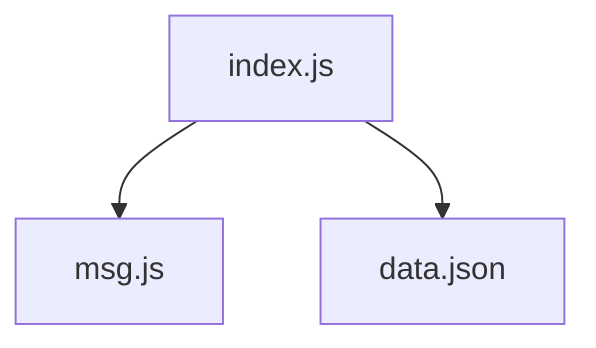
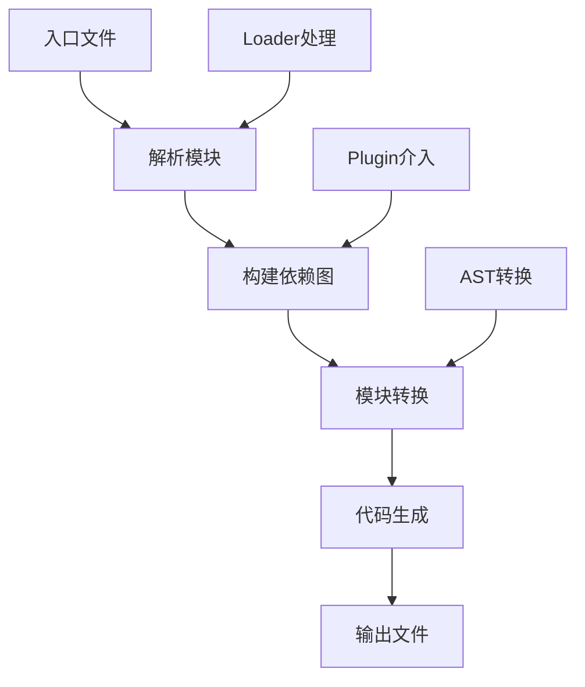
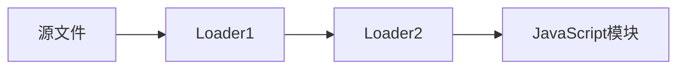
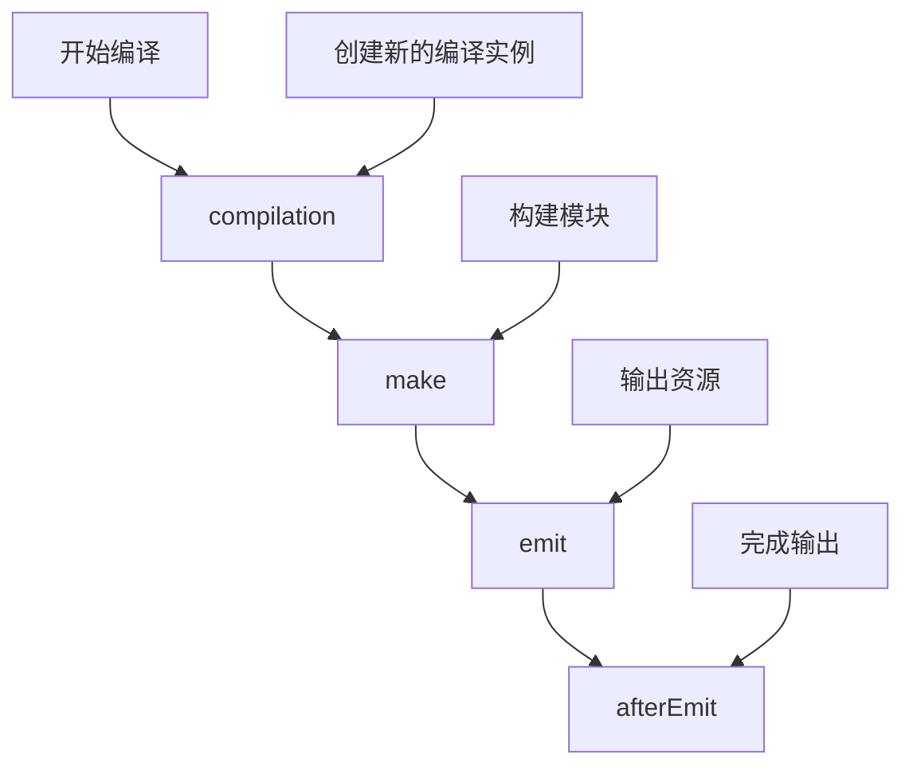

# web-genesis

[English](./README_EN.md) | 简体中文

`web-genesis` 是一个用于学习的迷你webpack实现，通过精简的源码帮助开发者理解webpack的核心原理。

## 目录
- [项目简介](#项目简介)
- [认识打包工具](#认识打包工具)
- [核心概念](#核心概念)
- [工作流程](#工作流程)
- [扩展机制](#扩展机制)
- [快速开始](#快速开始)

## 项目简介

### 背景
本项目旨在通过实现一个简化版的webpack，帮助开发者深入理解现代前端打包工具的工作原理。项目的源码位于`lib`目录下，保持了极致的精简以便于学习。

### 项目特点
- 源码精简，易于理解
- 实现webpack核心功能
- 提供完整的示例代码
- 支持自定义loader和plugin

## 认识打包工具

### 什么是打包工具？
打包工具是前端开发中的重要工具，它可以：
- 将分散的模块合并成单个文件
- 转换代码以支持不同环境
- 优化代码以提升性能

### 为什么需要打包？
1. **模块化开发**：
   - 开发时，我们喜欢将代码分割成小的模块，便于维护和复用
   - 但在生产环境，过多的模块会导致大量的HTTP请求，影响性能

2. **兼容性处理**：
   - 开发时，我们喜欢使用最新的JavaScript特性
   - 但在生产环境，需要考虑浏览器兼容性

3. **资源优化**：
   - 开发时，我们关注代码的可读性和可维护性
   - 但在生产环境，需要压缩代码、合并文件以优化加载性能

### 打包工具的分类

现代前端打包工具可以分为三类：

1. **Bundle型**
   - 代表：webpack、rollup、parcel
   - 特点：将所有模块打包成单个或少量文件
   - 工作方式：
     ```mermaid
     graph LR
         A[源码模块] --> B[构建依赖图]
         B --> C[合并代码]
         C --> D[单个bundle文件]
     ```
   - 适用：生产环境，需要考虑加载性能

2. **Bundleless型**
   - 代表：vite、snowpack
   - 特点：开发时保持模块独立，生产时打包
   - 工作方式：
     ```mermaid
     graph LR
         A[开发环境] --> B[保持ESM模块]
         A[开发环境] --> C[按需加载]
         D[生产环境] --> E[打包优化]
     ```
   - 适用：开发环境，提供更快的启动和热更新

3. **No-bundle型**
   - 代表：deno
   - 特点：直接使用ESM，完全不打包
   - 工作方式：
     ```mermaid
     graph LR
         A[ESM模块] --> B[浏览器直接加载]
         B --> C[HTTP/2多路复用]
     ```
   - 适用：现代浏览器，追求简单的开发体验

## 核心概念

在深入了解web-genesis之前，让我们先理解一些关键概念：

### Module（模块）
模块是源代码中的每个文件。例如在我们的示例中，有以下几个模块：
```js
// src/index.js - 入口模块
import msg from './msg.js';
import data from './data.json';
const parsedData = JSON.parse(data);
msg(`Hello ${parsedData.name}!!!`);

// src/msg.js - 消息处理模块
const sendMsg = (str) => {
  console.log(str);
};
export default sendMsg;

// src/data.json - 数据模块
{
  "name": "WebGenesis",
  "time": "2023/11/17",
  "desc": "Hope the world will be better"
}
```

### Bundle（打包产物）
Bundle是最终的打包产物，它将多个模块组合成单个文件。例如，上述三个模块最终会被打包成一个bundle文件：

```js
// dist/bundle.cjs
;(function(graph, moduleId) {
  function localRequire(relativePath) {
    return globalRequire(graph[moduleId].dependencies[relativePath]);
  }

  function globalRequire(moduleId) {
    var globalExports = {};
    ;(function(require, exports, code) {
      eval(code);
    })(localRequire, globalExports, graph[moduleId].code);
    return globalExports;
  }

  globalRequire(moduleId);
})({
  // 模块映射表
  "src/index.js": {
    dependencies: { "./msg.js": "src/msg.js", "./data.json": "src/data.json" },
    code: "..."
  },
  "src/msg.js": {
    dependencies: {},
    code: "..."
  },
  "src/data.json": {
    dependencies: {},
    code: "..."
  }
}, "src/index.js");
```

这个bundle文件做了几件事：
1. 创建一个模块映射表，包含所有模块的依赖关系和代码
2. 实现一个模块加载器（localRequire和globalRequire）
3. 从入口模块开始执行代码

### Chunk（代码块）
Chunk是webpack在打包过程中的中间产物，是模块的集合。在我们的实现中，可以在`Compiler.js`中看到chunk的处理过程：

```js
// lib/Compiler.js 中的相关代码
function run() {
  // 从入口模块开始收集依赖
  const info = this.build(this.entry);
  this.modules.push(info);

  // 递归处理所有依赖，形成chunk
  this.modules.forEach((obj) => {
    Object.keys(obj.dependencies).forEach((key) => {
      const dependency = obj.dependencies[key];
      const module = this.build(dependency);
      this.modules.push(module);
    });
  });

  // 将chunk转换为最终的依赖图
  const dependencyGraph = this.modules.reduce(
    (graph, item) => ({
      ...graph,
      [item.filename]: {
        dependencies: item.dependencies,
        code: item.code,
      },
    }),
    {}
  );
}
```

### Dependency Graph（依赖图）
依赖图是webpack通过分析模块间的依赖关系构建的有向图。在我们的示例中，依赖关系如下：



这个依赖图帮助webpack理解：
- 模块之间的引用关系
- 模块的加载顺序
- 哪些模块需要被打包到一起

## 工作流程

web-genesis的工作原理与webpack类似，让我们来看看它是如何工作的：



具体步骤说明：
1. **入口解析**：从entry配置开始，读取入口文件
2. **依赖解析**：使用`@babel/parser`将代码转换为AST，分析依赖关系
3. **模块转换**：使用配置的loader处理不同类型的文件
4. **代码生成**：将处理后的模块组合，生成最终的bundle文件
5. **输出文件**：将bundle写入指定的输出目录

## 扩展机制

web-genesis提供了两种扩展机制：Loader和Plugin，它们各自解决不同的问题。

### Loader

Loader 是文件转换器，用于将一种类型的文件转换成另一种类型。它的特点是：

1. **单一职责**：一个 Loader 只做一件事
2. **链式调用**：多个 Loader 可以串联使用
3. **执行顺序**：从右到左执行

#### Loader 示例

以我们的 JSON Loader 为例，它将 JSON 文件转换为可导入的 JavaScript 模块：

```js
// example/loaders/json-loader.cjs
function jsonLoader(code) {
  let res = code;
  if (typeof code === "string") {
    res = JSON.stringify(code);
  }
  return `export default ${res}`;
}

module.exports = jsonLoader;
```

使用方式：

```js
// webpack.config.cjs
module.exports = {
  module: {
    rules: [
      {
        test: /\.json$/,
        use: ['./loaders/json-loader.cjs']
      }
    ]
  }
};
```

#### Loader 工作流程



当一个文件匹配多个 Loader 时：
1. 每个 Loader 接收上一个 Loader 的结果（或源文件）
2. 可以链式调用多个 Loader
3. 最后一个 Loader 必须返回有效的 JavaScript 代码

### Plugin

Plugin 是打包过程的插件，它可以访问打包过程中的各个生命周期钩子。其特点是：

1. **功能强大**：可以介入打包过程的任何阶段
2. **事件驱动**：通过钩子（hooks）机制工作
3. **可配置性**：通常提供配置项来自定义行为

#### Plugin 示例

以我们的 HTML Plugin 为例，它在打包完成后生成 HTML 文件：

```js
// example/plugins/html-web-genesis-plugin.cjs
function HtmlWebGenesisPlugin(config) {
  this.filename = config.filename ?? "index.html";
  this.title = config.title ?? "";
}

HtmlWebGenesisPlugin.prototype.apply = function(compiler) {
  // 使用 emit 钩子，在生成文件前执行
  compiler.hooks.emit.tapAsync(
    "HtmlWebGenesisPlugin",
    (compilation, callback) => {
      const template = `
        <!DOCTYPE html>
        <html>
          <head>
            <title>${this.title}</title>
          </head>
          <body>
            <script src="${compilation.output.filename}"></script>
          </body>
        </html>
      `;
      
      // 写入 HTML 文件
      const outputPath = path.resolve(
        compilation.output.path, 
        this.filename
      );
      fs.writeFileSync(outputPath, template);
      callback();
    }
  );
};
```

使用方式：

```js
// webpack.config.cjs
const HtmlWebGenesisPlugin = require('./plugins/html-web-genesis-plugin.cjs');

module.exports = {
  plugins: [
    new HtmlWebGenesisPlugin({
      filename: 'index.html',
      title: 'Web Genesis Demo'
    })
  ]
};
```

#### Plugin 生命周期钩子

在web-genesis中，我们实现了以下关键的生命周期钩子：



每个钩子的作用：
- **compilation**：创建新的编译实例时触发
- **make**：正式开始编译时触发
- **emit**：输出资源到目录之前触发
- **afterEmit**：输出资源到目录之后触发

### Loader vs Plugin 对比

| 特性 | Loader | Plugin |
|------|---------|---------|
| 执行时机 | 模块加载时 | 整个构建生命周期 |
| 功能范围 | 文件转换 | 打包过程干预 |
| 编写方式 | 纯函数 | 带有 apply 方法的类 |
| 调用方式 | 链式调用 | 独立调用 |
| 使用场景 | 处理非 JS 文件 | 打包优化、资源管理等 |

## 快速开始

### 安装依赖
```shell
npm install
```

### 运行示例
在`example`目录下提供了完整的使用示例，展示了：
- 基本的打包配置
- 自定义loader的实现和使用
- 自定义plugin的实现和使用

```shell
cd example
npm run build
```

查看`dist`目录下的打包产物，了解打包过程的输出结果。

### 项目依赖
本项目使用了以下核心依赖：

- `@babel/core`：提供babel相关API
- `@babel/preset-env`：将ES6+风格的JavaScript代码转换为ES5
- `@babel/parser`：分析JavaScript代码并将其转换为AST
- `@babel/traverse`：遍历AST
- `tapable`：在特定阶段注入代码以实现插件机制
