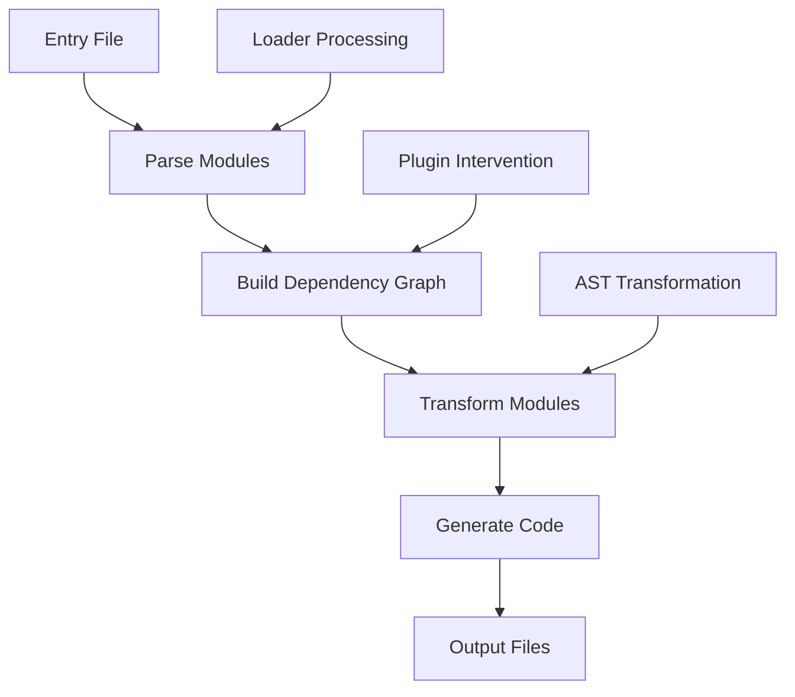

# web-genesis

English | [简体中文](./README.md)

`web-genesis` is a mini webpack implementation for learning purposes, helping developers understand webpack's core principles through minimalist source code.

## Table of Contents
- [Introduction](#introduction)
- [Understanding Bundlers](#understanding-bundlers)
- [Core Concepts](#core-concepts)
- [Workflow](#workflow)
- [Extension Mechanisms](#extension-mechanisms)
- [Getting Started](#getting-started)

## Introduction

### Background
This project aims to help developers deeply understand modern frontend bundling tools by implementing a simplified version of webpack. The source code is located in the `lib` directory, kept minimal for learning purposes.

### Features
- Minimalist source code, easy to understand
- Implements webpack core functionality
- Provides complete example code
- Supports custom loaders and plugins

## Understanding Bundlers

### What is a Bundler?
A bundler is an essential tool in frontend development that can:
- Combine scattered modules into a single file
- Transform code to support different environments
- Optimize code for better performance

### Why Do We Need Bundlers?
1. **Modular Development**:
   - During development, we prefer splitting code into small modules for maintainability and reusability
   - However, in production, too many modules lead to multiple HTTP requests, affecting performance

2. **Compatibility Handling**:
   - During development, we like using the latest JavaScript features
   - However, in production, we need to consider browser compatibility

3. **Resource Optimization**:
   - During development, we focus on code readability and maintainability
   - However, in production, we need to minify code and merge files for better loading performance

### Types of Bundlers

Modern frontend bundlers can be categorized into three types:

1. **Bundle-based**
   - Examples: webpack, rollup, parcel
   - Features: Combines all modules into single or few files
   - Workflow:
     ```mermaid
     graph LR
         A[Source Modules] --> B[Build Dependency Graph]
         B --> C[Merge Code]
         C --> D[Single Bundle File]
     ```
   - Best for: Production environments, loading performance

2. **Bundleless**
   - Examples: vite, snowpack
   - Features: Keeps modules separate during development, bundles for production
   - Workflow:
     ```mermaid
     graph LR
         A[Development] --> B[Keep ESM Modules]
         A[Development] --> C[Load on Demand]
         D[Production] --> E[Bundle Optimization]
     ```
   - Best for: Development environment, faster startup and HMR

3. **No-bundle**
   - Examples: deno
   - Features: Direct ESM usage, no bundling needed
   - Workflow:
     ```mermaid
     graph LR
         A[ESM Modules] --> B[Browser Direct Loading]
         B --> C[HTTP/2 Multiplexing]
     ```
   - Best for: Modern browsers, simple development experience

## Core Concepts

Before diving into web-genesis, let's understand some key webpack concepts:

- **Bundle**: The final output file that combines multiple modules
- **Chunk**: Code blocks that are intermediate products during webpack's bundling process
- **Module**: Each file in the source code is treated as a module
- **Dependency Graph**: A directed graph built by webpack by analyzing dependencies between modules

## Workflow

The core workflow of web-genesis (and webpack) is as follows:



Detailed steps:
1. **Entry Parsing**: Start from the entry configuration and read entry files
2. **Dependency Resolution**: Convert code to AST using `@babel/parser` and analyze dependencies
3. **Module Transformation**: Process different file types using configured loaders
4. **Code Generation**: Combine processed modules to generate the final bundle
5. **File Output**: Write the bundle to the specified output directory

## Extension Mechanisms

The extension mechanisms of web-genesis include:

- **Custom Loaders**: Allows developers to process different file types
- **Custom Plugins**: Allows developers to intervene at different stages of the bundling process

## Getting Started

The `example` directory provides complete usage examples showing:
- Basic bundling configuration
- Custom loader implementation and usage
- Custom plugin implementation and usage

To run the example:
```shell
cd example
npm run build
```

Check the bundled output in the `dist` directory to understand the bundling results. 